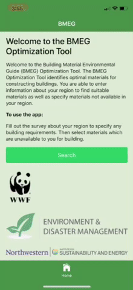

# Building Materials Environmental Guide (BMEG)
## Description
Automating BMEG to allow construction professionals to find the most environmentally friendly and cost effective building materials post natural disasters

Flow of the BMEG app (all of the pages are located in the src folder):
Home Page-> Regionsurvey Page-> Search Page-> Results Page-> Buildingplans Page


## Prerequisites

- Node >= 8.0
- Python >= 2.7
- Git CLI

## How to download and install the app

In Terminal, type the following commands:

```
mkdir BMEG
git clone https://github.com/eecs394-s18/BMEG.git .
cd BMEG_app
npm install
```

This will install all required dependencies needed for the app to run.

## How to build and deploy the app
### Web deploy
```
ionic serve
```
### iOS deploy
```
ionic cordova build ios --prod --release
```
### Android deploy
```
ionic cordova build android --prod --release
```
If you run into problems refer to [Deploying to a Device](https://ionicframework.com/docs/intro/deploying/).

## App Limitations
After the "Find Materials" button on the region survey page is clicked, it is supposed to narrow down the materials shown to the user in the drop down menu on the Search page. Currently, since the algorithm that determines which materials to use based on lowest cost and energy only works for 2 unavailable materials, the line of code that actually reduces the number of materials shown on the Search page is commented out. Once the algorithm is updated to work for all combinations of materials, you can uncomment these line of code in `regionsurvey.ts` (lines 54-56):

```typescript
if (acidic && !data[key]["acidic"]) shouldAdd = false;
if (alkali && !data[key]["alkaline"]) shouldAdd = false;
if (salt && !data[key]["salt_water"]) shouldAdd = false;
```

Additionally, the user is only allowed to select up to two unavailable materials on the search page right now.

## How to update the app as the algorithm provides more data

A Python script is provided to convert the CSV files generated by the algorithm into a JSON format that our app can read.

To use the script, navigate to `./BMEG_app/src/scripts` from the root directory and issue the command:

```
python converter.py
```

The JSON files will be outputted to the `./BMEG_app/src/assets/database` folder.

### Notes on using the Python script

1. The CSV files must belong in the same directory as the Python script.
2. Format of CSV files must be **exactly** like the sample ones currently provided in the directory. Otherwise, the script may not run properly.
3. The names of the CSV files do not have to match that of those currently in the directory. Should they be different, please just open `converter.py` and provide the appropriate filenames on lines 19 and 42.

**Script Limitation:** The provided Python script has only been tested on 0-2 unavailable materials. It *should* work with 3 or more unavailable materials, but it has not been tested before - please double check data integrity after running.

### JSON Structure

Following is the JSON structure for floor number, wall number, roof number, and option:

```
{
  "[id_number]": "[name_associated_with_id]",
  "[id_number]": "[name_associated_with_id]",
  "[id_number]": "[name_associated_with_id]"
  ...
}
```

The JSON structure for scenario has the key-value pairs reversed:

```
{
  "[name_associated_with_scenario]": "[scenario_number]",
  "[name_associated_with_scenario]": "[scenario_number]",
  "[name_associated_with_scenario]": "[scenario_number]"
  ...
}
```

Finally, the JSON structure for results:

```

  "[scenario_number]": {
    "[option_number]": {
      "energy": "[...]",
      "cost": "[...]",
      "walls": "[wall_id]",
      "roof": "[roof_id]",
      "floor": "[floor_id]"
    },
    "[option_number]": {
      "energy": "[...]",
      "cost": "[...]",
      "walls": "[wall_id]",
      "roof": "[roof_id]",
      "floor": "[floor_id]"
    },
    "[option_number]": {
      "energy": "[...]",
      "cost": "[...]",
      "walls": "[wall_id]",
      "roof": "[roof_id]",
      "floor": "[floor_id]"
    }
  },
  "[scenario_number]": {
    "[option_number]": {
      "energy": "[...]",
      "cost": "[...]",
      "walls": "[wall_id]",
      "roof": "[roof_id]",
      "floor": "[floor_id]"
    },
    "[option_number]": {
      "energy": "[...]",
      "cost": "[...]",
      "walls": "[wall_id]",
      "roof": "[roof_id]",
      "floor": "[floor_id]"
    },
    "[option_number]": {
      "energy": "[...]",
      "cost": "[...]",
      "walls": "[wall_id]",
      "roof": "[roof_id]",
      "floor": "[floor_id]"
    }
  }
  ...
```
